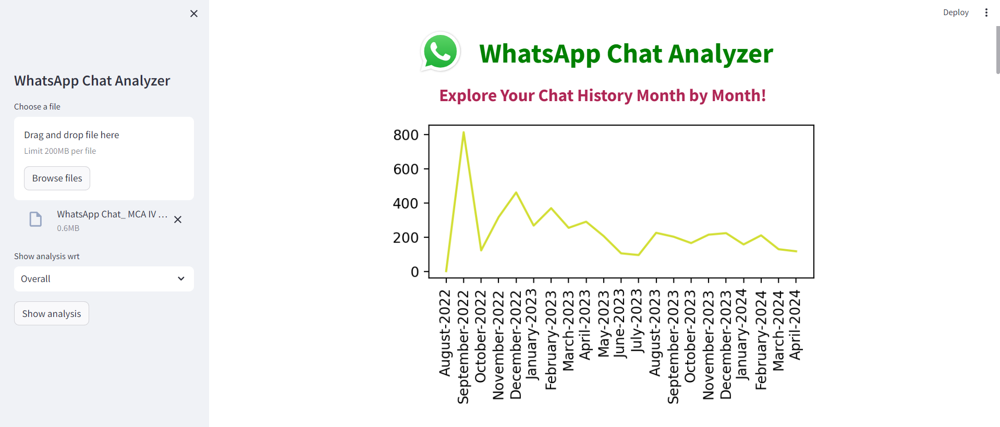
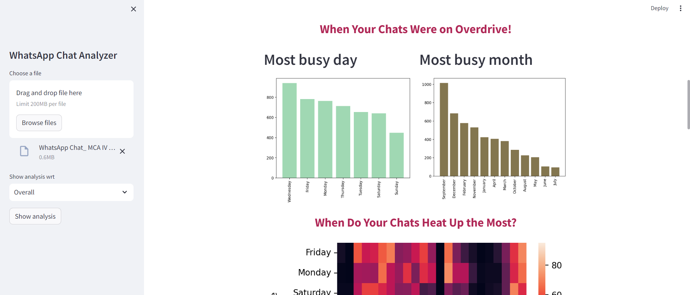
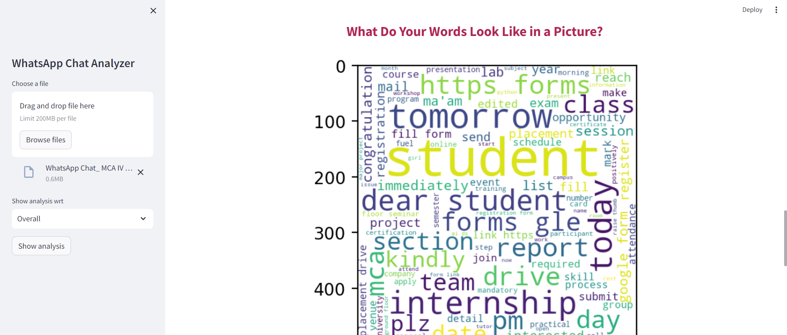

<h3>📊 WhatsApp Chat Analyzer</h3>  
Analyze and visualize your WhatsApp chat data with detailed insights! This tool helps you understand your conversations like never before by breaking down message patterns, activity times, and even your favorite emojis.  

 <h5>🚀 Features </h5> 
🕒 Message Activity Tracking: See when your chats are most active by date and time. 
👥 Participant Insights: Identify who contributes the most in group chats. 
💬 Message Type Breakdown: Distinguish between text, media, and links in your chats. 
📝 Word Usage Analysis: Discover the most frequently used words. 
😀 Top Emoji Summary: See which emojis dominate your conversations. 
📈 Data Visualization: Easy-to-read charts and graphs for a clear view of chat dynamics. 
 <h5>🛠How It Works</h5> 
Export your WhatsApp chat as a .txt file. 
Upload the chat file to the tool. 
Let the analyzer crunch the data and generate comprehensive insights. 
View results in neat graphs and summaries. 
 <h5>🔍 Use Cases </h5>  
Group Chat Insights: Identify who’s the most active participant. 
Time-based Analysis: Find out when your chats peak in activity. 
Emoji & Word Trends: Spot commonly used emojis and words to better understand conversation tone. 
📋 <h5>Future Enhancements </h5> 
📅 Date-based Filters: Analyze chats over custom time periods. 
📊 Advanced Data Visualizations: More ways to visualize message trends and patterns. 
